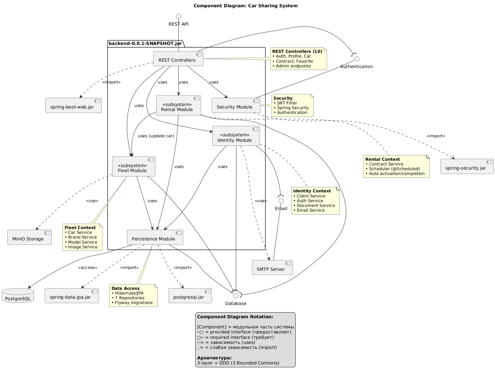
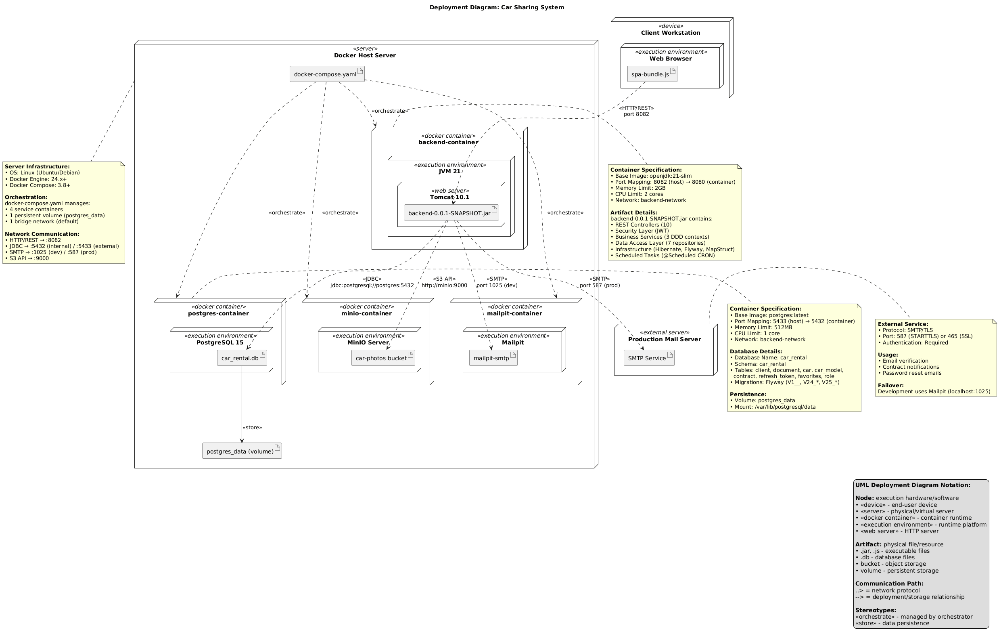
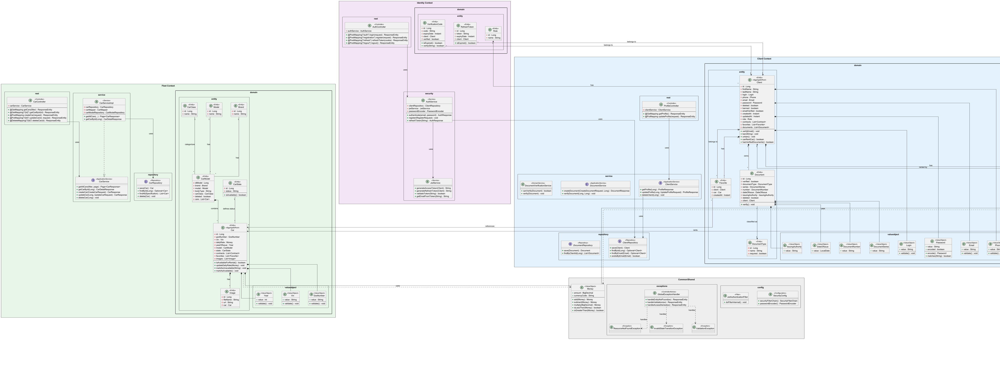
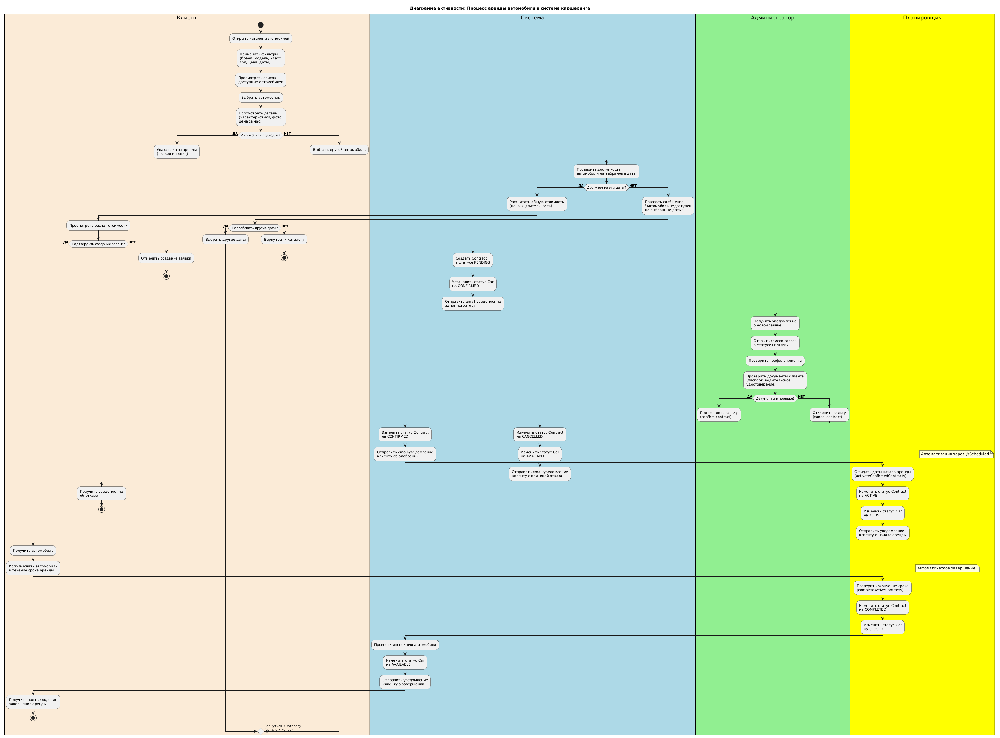

# Car Sharing — Документация проекта

<div align="center">

**Платформа каршеринга: Backend · Frontend · Mobile**

Java 21 · Spring Boot 3.5 · Vue 3 · PostgreSQL · JWT (HS256) · MinIO · Docker

</div>

---

## Содержание

- [Мобильное приложение](#мобильное-приложение)
- [Frontend](#frontend)
  - [Стек Frontend](#стек-frontend)
  - [Структура Frontend](#структура-frontend)
  - [Страницы и маршруты](#страницы-и-маршруты)
  - [Управление состоянием](#управление-состоянием-pinia)
  - [HTTP-клиент](#http-клиент-axios)
  - [Запуск Frontend](#запуск-frontend)
- [Backend — общее описание](#backend--общее-описание)
- [Технологический стек](#технологический-стек-backend)
- [Архитектура](#архитектура)
- [Структура проекта](#структура-проекта)
- [База данных](#база-данных)
- [API — эндпоинты](#api--эндпоинты)
  - [Аутентификация](#аутентификация-apiauth)
  - [Каталог автомобилей](#каталог-автомобилей-apicar)
  - [Профиль пользователя](#профиль-пользователя-apiprofile)
  - [Избранное](#избранное-apicars)
  - [Договоры аренды](#договоры-аренды-apicontracts)
  - [Аналитика](#аналитика-apianalysis)
  - [Администрирование](#администрирование-apiadmin)
- [Безопасность](#безопасность)
- [Конфигурация](#конфигурация)
- [Быстрый старт](#быстрый-старт)
- [Тестирование](#тестирование)
- [Диаграммы](#диаграммы)
- [Дорожная карта](#дорожная-карта)

---

> Разделы ниже относятся к **Backend-сервису** (`backend/`).  
> Frontend описан выше. Мобильное приложение — в первом разделе.

---

## Мобильное приложение

> **Этот раздел зарезервирован для описания мобильного клиента.**
>
> _Здесь будет описание мобильного приложения: платформа (Android/iOS/Flutter/React Native), ключевые экраны, навигация, интеграция с API, скриншоты и инструкция по сборке._

---

## Frontend

Веб-клиент платформы — SPA на Vue 3, расположен в `frontend/`. Работает на порту **5176** и общается с backend через REST API.

### Стек Frontend

| Категория | Инструмент / версия |
|---|---|
| Фреймворк | Vue 3.3.0 |
| Сборка | Vite 5.4.0 |
| Маршрутизация | Vue Router 4.2.0 |
| Состояние | Pinia 3.0.3 |
| HTTP-клиент | Axios 1.12.2 |
| Графики | Chart.js 4.5.1 |
| Стили | Tailwind CSS 3.4.18 |
| JWT-парсинг | jwt-decode 4.0.0 |
| Плагин сборки | @vitejs/plugin-vue 6.0.0 |

### Структура Frontend

```
frontend/src/
├── api/
│   └── client.js          # Низкоуровневые вызовы API (getCars, getCar, createContract …)
├── services/
│   ├── api.js             # Axios-инстанс + интерцептор авто-refresh токена
│   ├── authService.js     # login, logout, register, getCurrentUser
│   ├── carService.js      # Каталог, фильтры, детали авто
│   ├── contractService.js # Договоры аренды
│   ├── profileService.js  # Профиль, документы
│   ├── adminService.js    # Все /api/admin/* вызовы
│   └── analyticsService.js# Статистика
├── store/
│   ├── auth.js            # Pinia-стор: user, isAuthenticated, isAdmin, login/logout
│   └── index.js           # Создание Pinia-инстанса
├── router/
│   └── index.js           # Маршруты + navigation guards
├── views/                 # Страницы (по одной на маршрут)
├── components/
│   ├── layout/            # Header, Footer
│   ├── ui/                # Card, Button, Dropdown, SearchInput, NotificationModal
│   ├── profile/           # ProfileHeader, ProfileInfo, DocumentCard, PasswordCard …
│   ├── sections/          # HeroSection (главная страница)
│   └── admin/             # CarsManagement, ClientsManagement, ContractsManagement …
├── composables/           # Vue Composition API хуки
├── utils/                 # errorHandler и другие утилиты
├── assets/                # Статические ресурсы
├── App.vue
└── main.js
```

### Страницы и маршруты

| Маршрут | Компонент | Доступ | Описание |
|---|---|---|---|
| `/` | `HomeView` | Все | Главная страница, каталог авто с фильтрацией |
| `/car/:id` | `CarDetailsView` | Все | Детали автомобиля |
| `/auth` | `AuthView` | Все | Вход и регистрация |
| `/verify` | `VerifyEmailView` | Все | Подтверждение email по коду из письма |
| `/reset` | `ResetPasswordView` | Все | Сброс пароля |
| `/profile` | `ProfileView` | Авторизован | Профиль, документы, смена пароля |
| `/contracts` | `ContractsView` | Авторизован | Список договоров аренды |
| `/contracts/:id` | `ContractDetailsView` | Авторизован | Детали договора |
| `/contract/new` | `CreateContractView` | Авторизован | Создание нового договора |
| `/favorites` | `FavoritesView` | Авторизован | Избранные автомобили |
| `/statistics` | `StatisticsView` | Авторизован | Статистика пользователя |
| `/admin` | `AdminView` | ADMIN | Панель администратора |
| `/admin/cars/new` | `AdminCarCreateView` | ADMIN | Добавление автомобиля |
| `/admin/cars/:id` | `AdminCarDetailsView` | ADMIN | Редактирование авто |
| `/admin/users/:id` | `AdminUserDetailsView` | ADMIN | Детали пользователя |
| `/admin/contracts/:id` | `AdminContractDetailsView` | ADMIN | Детали договора (admin) |
| `/*` | — | — | Редирект на `/` |

**Navigation guard** в `router/index.js` автоматически:
- перенаправляет незалогиненных на `/auth` при попытке зайти на защищённый маршрут;
- перенаправляет не-администраторов с `/admin/*` на главную.

### Управление состоянием (Pinia)

Единственный стор — `useAuthStore` (`store/auth.js`):

| Поле / геттер | Тип | Описание |
|---|---|---|
| `user` | `ref` | Объект текущего пользователя (null если не авторизован) |
| `loading` | `ref` | Флаг выполнения async-операции |
| `error` | `ref` | Текст последней ошибки |
| `isAuthenticated` | `computed` | `true` если `user !== null` |
| `isAdmin` | `computed` | `true` если роль `ROLE_ADMIN` или `ROLE_MANAGER` |
| `username` | `computed` | Логин текущего пользователя |
| `userRoles` | `computed` | Массив строковых ролей |

Действия: `login`, `register`, `logout`, `fetchUser`, `checkAuth`, `clearError`.

### HTTP-клиент (Axios)

`services/api.js` — центральный Axios-инстанс:

```
baseURL : http://localhost:8082/api
timeout : 10 000 мс
withCredentials : true   ← обязательно для передачи cookie с токенами
```

**Интерцептор авто-refresh:** при получении `401` клиент автоматически делает `POST /refresh`. Параллельные запросы ставятся в очередь и повторяются после успешного обновления токена. Если refresh тоже вернул `401` — происходит редирект на `/auth`.

### Запуск Frontend

```bash
cd frontend

# Установить зависимости
npm install

# Режим разработки (http://localhost:5176)
npm run dev

# Production-сборка
npm run build

# Предпросмотр production-сборки
npm run preview
```

---

## Backend — общее описание

Проект — backend-сервис платформы каршеринга. Предоставляет REST API для:

- регистрации и аутентификации пользователей (JWT, email-верификация, сброс пароля);
- просмотра каталога автомобилей с расширенной фильтрацией;
- управления договорами аренды (создание, изменение дат, отмена);
- ведения списка избранных автомобилей;
- загрузки и хранения фотографий авто (MinIO);
- административного управления автопарком, пользователями и документами;
- сбора аналитики и статистики.

Сервис работает на порту **8082** и взаимодействует с отдельным сервисом аутентификации (**auth-service**, порт 8083).

---

## Технологический стек Backend

| Категория | Инструмент / версия |
|---|---|
| Язык | Java 21 |
| Фреймворк | Spring Boot 3.5.6 |
| Web / API | Spring Web (REST) |
| Безопасность | Spring Security, JJWT 0.11.5 (RS256) |
| Данные | Spring Data JPA, Hibernate |
| База данных | PostgreSQL 16 |
| Миграции БД | Flyway 11.15.0 |
| Маппинг DTO | MapStruct 1.6.3 |
| Снижение шаблонного кода | Lombok |
| Документация API | springdoc-openapi 2.8.14 (Swagger UI) |
| Объектное хранилище | MinIO 8.6.0 |
| Почта | Spring Mail + Mailpit (dev) |
| Тесты | JUnit 5, Spring Boot Test, Testcontainers 1.21.3 |
| Покрытие кода | JaCoCo (≥ 80 % instruction, ≥ 60 % branch) |
| Сборка | Maven + Maven Wrapper |
| Контейнеризация | Docker, Docker Compose |
| Мониторинг | Spring Actuator |

---

## Архитектура

Backend-сервис — самодостаточное Spring Boot-приложение. Аутентификация и бизнес-логика находятся в одном сервисе; внешних зависимостей между сервисами нет.

> В репозитории также присутствует `auth-service/` — отдельный экспериментальный сервис с DDD-архитектурой и RS256-токенами. Он **не интегрирован** в основной backend: между ними нет HTTP-вызовов, общей шины или shared-библиотеки. Это независимый проект.

```
┌────────────────────────────────────────────────────────────┐
│                        Клиенты                             │
│           Web (Vue 3)  /  Mobile  /  Swagger UI            │
└────────────────┬───────────────────────────────────────────┘
                 │ HTTP
     ┌───────────▼───────────────────────────────┐
     │            backend  :8082                 │
     │  REST API · Spring Security · JWT (HS256) │
     └───────────┬───────────────────────────────┘
                 │
     ┌───────────▼───────────┐   ┌───────────────────────┐
     │  PostgreSQL  :5433    │   │  MinIO  :9000          │
     │  car_rental (schema)  │   │  (хранение фото)       │
     └───────────────────────┘   └───────────────────────┘
                 │
     ┌───────────▼───────────┐
     │  Mailpit  :1025/8025  │
     │  (перехват писем, dev)│
     └───────────────────────┘
```

Внутри сервис разбит на слои:

```
rest (Controllers)
    └── service (Business Logic)
            └── repository (Spring Data JPA)
                    └── entity (JPA Entities)
```

Все DTO маппируются через MapStruct; конвертация между слоями не происходит вручную.

---

## Структура проекта

```
backend/
├── diagrams/                        # UML-диаграммы (PNG, PUML, PDF)
│   ├── sequence/                    # Диаграммы последовательностей
│   ├── activity/                    # Диаграмма активности
│   ├── component/                   # Компонентная диаграмма
│   ├── class/                       # Диаграмма классов
│   └── deployment/                  # Диаграмма развертывания
├── src/
│   ├── main/
│   │   ├── java/
│   │   │   └── com/example/carshering/
│   │   │       ├── config/          # Конфигурация (CORS, MinIO, Web)
│   │   │       ├── dto/
│   │   │       │   ├── request/
│   │   │       │   │   ├── create/  # CreateCarRequest, CreateContractRequest …
│   │   │       │   │   └── update/  # UpdateCarRequest, UpdateProfileRequest …
│   │   │       │   └── response/    # *Response DTOs
│   │   │       ├── entity/
│   │   │       │   ├── auth/        # RefreshToken, Role, VerificationCode
│   │   │       │   ├── cars/        # Car, CarModel, Brand, CarClass, CarState,
│   │   │       │   │                #   Favorite, Image
│   │   │       │   ├── rent/        # Contract, RentalState
│   │   │       │   └── user/        # Client, Document, DocumentType
│   │   │       ├── exceptions/      # Кастомные исключения
│   │   │       ├── mapper/          # MapStruct-маппинги
│   │   │       ├── repository/      # Spring Data JPA репозитории
│   │   │       ├── rest/
│   │   │       │   ├── all/         # Публичные (для авторизованных) контроллеры
│   │   │       │   │   ├── AuthController
│   │   │       │   │   ├── CarController
│   │   │       │   │   ├── ContractController
│   │   │       │   │   ├── ProfileController
│   │   │       │   │   ├── FavoriteController
│   │   │       │   │   ├── EmailController
│   │   │       │   │   └── AnalysisController
│   │   │       │   └── admin/       # Только для ADMIN
│   │   │       │       ├── AdminCarController
│   │   │       │       ├── AdminClientController
│   │   │       │       ├── AdminContractController
│   │   │       │       ├── AdminDocumentController
│   │   │       │       ├── AdminAnalysisController
│   │   │       │       ├── AdminModelDetailsController
│   │   │       │       └── CarImageController
│   │   │       ├── security/        # Фильтры и настройка Spring Security
│   │   │       └── service/
│   │   │           ├── interfaces/  # Интерфейсы сервисов
│   │   │           ├── impl/        # Реализации
│   │   │           └── domain/      # Доменные сервисы
│   │   └── resources/
│   │       ├── application.yaml     # Основная конфигурация
│   │       └── db/migration/        # Flyway-миграции (V1 … V25_1_x)
│   └── test/
│       ├── java/                    # Тесты (JUnit 5, Testcontainers)
│       └── resources/               # Тестовые настройки и миграции
├── docker-compose.yaml              # PostgreSQL (порт 5433 наружу)
├── docker-compose.dev.yml           # Mailpit
├── docker-compose_miniIo.yml        # MinIO
└── pom.xml
```

---

## База данных

База данных: `car_sharing_db`, схема: `car_rental`.  
Миграции управляются Flyway (19 файлов, от V1 до V25_1_x).

### Таблицы

#### Пользователи

| Таблица | Описание |
|---|---|
| `car_rental.client` | Учётные записи пользователей |
| `car_rental.document` | Документы пользователя (паспорт, ВУ) |
| `car_rental.document_type` | Типы документов |

**Ключевые поля `client`:** `id`, `first_name`, `last_name`, `login`, `email`, `phone`, `password` (BCrypt), `email_verified`, `deleted`, `banned`, `role_id`, `created_at`, `updated_at`

#### Автомобили

| Таблица | Описание |
|---|---|
| `car_rental.car` | Конкретные экземпляры автомобилей |
| `car_rental.car_model` | Модели (бренд, кузов, класс) |
| `car_rental.brand` | Марки авто |
| `car_rental.car_class` | Классы (Эконом, Бизнес, Премиум …) |
| `car_rental.car_state` | Статус авто (AVAILABLE, RENTED, MAINTENANCE …) |
| `car_rental.image` | Ссылки на фотографии (MinIO) |

**Ключевые поля `car`:** `id`, `gos_number` (госномер), `vin`, `year_of_issue`, `rent` (цена/день), `image_url`, `model_id`, `state_id`

#### Аренда

| Таблица | Описание |
|---|---|
| `car_rental.contract` | Договоры аренды |
| `car_rental.rental_state` | Статусы договора (PENDING, ACTIVE, COMPLETED, CANCELLED) |

**Ключевые поля `contract`:** `id`, `car_id`, `client_id`, `state_id`, `start_date`, `end_date`, `total_cost`, `created_at`

#### Прочее

| Таблица | Описание |
|---|---|
| `car_rental.favorite` | Избранные авто пользователя (many-to-many) |
| `car_rental.refresh_token` | Сессионные токены (хранятся как BCrypt-хэш) |
| `car_rental.role` | Роли пользователей |
| `car_rental.verification_code` | Коды для верификации email |

### ER-диаграмма

.png)

### Связи между сущностями

```
Client ──< Contract >── Car ──< Image
  │                     │
  └──< Favorite >──────┘
  │
  └── Document
  │
  └── Role
```

---

## API — эндпоинты

Swagger UI доступен по адресу: `http://localhost:8082/swagger-ui/index.html`

Базовый URL всех эндпоинтов: `/api`

Все защищённые эндпоинты требуют заголовок:
```
Authorization: Bearer <access_token>
```

---

### Аутентификация `/api/auth`

> Доступно без авторизации (публичные эндпоинты).

| Метод | Путь | Описание |
|---|---|---|
| `POST` | `/api/auth` | Вход пользователя. Тело: `{ login, password }`. Возвращает `access_token` и `refresh_token`. |
| `POST` | `/api/registration` | Регистрация. Тело: `{ firstName, lastName, login, email, phone, password }`. |
| `POST` | `/api/logout` | Инвалидация текущего refresh-токена. |
| `POST` | `/api/refresh` | Обновление access-токена. Тело: `{ refreshToken }`. |
| `POST` | `/api/reset` | Сброс пароля по коду из письма. |
| `POST` | `/api/email/forgot` | Запрос письма для сброса пароля. Тело: `{ email }`. |
| `GET` | `/api/email/verify` | Подтверждение email по коду из письма. Query: `?code=...`. |

---

### Каталог автомобилей `/api/car`

> Требует авторизации.

| Метод | Путь | Описание |
|---|---|---|
| `GET` | `/api/car/catalogue` | Постраничный список доступных авто с фильтрацией. |
| `GET` | `/api/car/{carId}` | Подробная информация об автомобиле. |
| `GET` | `/api/car/filters/brands` | Список всех марок. |
| `GET` | `/api/car/filters/models` | Список всех моделей. |
| `GET` | `/api/car/filters/classes` | Список всех классов. |
| `GET` | `/api/car/filters/body-types` | Список всех типов кузова. |
| `GET` | `/api/car/filters/min-max-cell` | Минимальная и максимальная цена аренды в день. |

**Параметры фильтрации `/api/car/catalogue`:**

| Параметр | Тип | Описание |
|---|---|---|
| `brand` | `String` | Марка |
| `model` | `String` | Модель |
| `minYear` | `int` | Год выпуска от |
| `maxYear` | `int` | Год выпуска до |
| `body_type` | `String` | Тип кузова |
| `car_class` | `String` | Класс авто |
| `date_start` | `LocalDate` | Дата начала аренды (для проверки доступности) |
| `date_end` | `LocalDate` | Дата окончания аренды |
| `min_cell` | `BigDecimal` | Минимальная цена |
| `max_cell` | `BigDecimal` | Максимальная цена |
| `page` | `int` | Страница (default: 0) |
| `size` | `int` | Размер страницы (default: 20, max: 100) |

---

### Профиль пользователя `/api/profile`

> Требует авторизации.

| Метод | Путь | Описание |
|---|---|---|
| `GET` | `/api/profile/` | Полный профиль текущего пользователя. |
| `GET` | `/api/profile/me` | Базовая информация о текущем пользователе. |
| `PATCH` | `/api/profile/` | Обновление профиля (имя, фамилия, телефон). |
| `PATCH` | `/api/profile/password` | Смена пароля. Тело: `{ oldPassword, newPassword }`. |
| `DELETE` | `/api/profile/` | Удаление аккаунта. |
| `GET` | `/api/profile/verify` | Отправить письмо для верификации email. |
| `GET` | `/api/profile/document` | Получить документ пользователя. |
| `POST` | `/api/profile/document` | Загрузить документ. |
| `PATCH` | `/api/profile/document` | Обновить документ. |
| `DELETE` | `/api/profile/document` | Удалить документ. |

---

### Избранное `/api/cars`

> Требует авторизации.

| Метод | Путь | Описание |
|---|---|---|
| `GET` | `/api/cars/favorites` | Список избранных авто (постранично). |
| `POST` | `/api/cars/favorites/{carId}` | Добавить авто в избранное. |
| `DELETE` | `/api/cars/favorites/{carId}` | Убрать авто из избранного. |
| `GET` | `/api/cars/favorites/{carId}` | Проверить, находится ли авто в избранном. |

---

### Договоры аренды `/api/contracts`

> Требует авторизации.

| Метод | Путь | Описание |
|---|---|---|
| `POST` | `/api/contracts/` | Создать договор аренды. Тело: `{ carId, startDate, endDate }`. |
| `GET` | `/api/contracts/` | Список договоров текущего пользователя (постранично). |
| `GET` | `/api/contracts/{contractId}` | Детали конкретного договора. |
| `PATCH` | `/api/contracts/{contractId}` | Изменить даты аренды. |
| `DELETE` | `/api/contracts/{contractId}/cancel` | Отменить договор. |

**Статусы договора:**

| Статус | Описание |
|---|---|
| `PENDING` | Ожидает подтверждения |
| `ACTIVE` | Аренда активна |
| `COMPLETED` | Аренда завершена |
| `CANCELLED` | Отменено |

---

### Аналитика `/api/analysis`

> Требует авторизации.

| Метод | Путь | Описание |
|---|---|---|
| `GET` | `/api/analysis` | Общая статистика платформы |

---

### Администрирование `/api/admin`

> Требует роли `ADMIN`.

#### Автомобили `/api/admin/cars`

| Метод | Путь | Описание |
|---|---|---|
| `POST` | `/api/admin/cars/` | Создать авто (multipart/form-data: данные + фото). |
| `GET` | `/api/admin/cars/{carId}` | Получить авто. |
| `PATCH` | `/api/admin/cars/{carId}` | Обновить данные авто. |
| `PATCH` | `/api/admin/cars/{carId}/state` | Изменить статус авто. |

#### Фотографии `/api/admin/images`

| Метод | Путь | Описание |
|---|---|---|
| `POST` | `/api/admin/images/upload` | Загрузить изображение в MinIO. Возвращает URL. |
| `DELETE` | `/api/admin/images/{filename}` | Удалить изображение. |

#### Модели и марки `/api/admin/models`

| Метод | Путь | Описание |
|---|---|---|
| `GET` | `/api/admin/models/` | Список всех моделей. |
| `POST` | `/api/admin/models/` | Создать модель (марка, тип кузова, класс). |
| `PATCH` | `/api/admin/models/{modelId}` | Обновить модель. |
| `DELETE` | `/api/admin/models/{modelId}` | Удалить модель. |
| `GET` | `/api/admin/models/brands` | Список марок. |
| `POST` | `/api/admin/models/brands` | Создать марку. |

#### Пользователи `/api/admin/clients`

| Метод | Путь | Описание |
|---|---|---|
| `GET` | `/api/admin/clients/` | Список всех пользователей. |
| `GET` | `/api/admin/clients/{clientId}` | Детали пользователя. |
| `PATCH` | `/api/admin/clients/{clientId}/ban` | Заблокировать / разблокировать пользователя. |

#### Договоры `/api/admin/contracts`

| Метод | Путь | Описание |
|---|---|---|
| `GET` | `/api/admin/contracts/` | Список всех договоров. |
| `GET` | `/api/admin/contracts/{contractId}` | Детали договора. |
| `PATCH` | `/api/admin/contracts/{contractId}/state` | Изменить статус договора. |

#### Документы `/api/admin/documents`

| Метод | Путь | Описание |
|---|---|---|
| `GET` | `/api/admin/documents/` | Список всех документов. |
| `GET` | `/api/admin/documents/{documentId}` | Просмотр документа. |
| `PATCH` | `/api/admin/documents/{documentId}/verify` | Верифицировать / отклонить документ. |

#### Аналитика (admin) `/api/admin/analysis`

| Метод | Путь | Описание |
|---|---|---|
| `GET` | `/api/admin/analysis` | Расширенная статистика и метрики. |

---

## Безопасность

### JWT (HS256)

- **Алгоритм подписи:** HMAC-SHA256 (симметричный, shared secret).
- **Access token:** TTL 30 минут. Секрет задаётся в `application.yaml` (`jwt.secret`).
- **Refresh token:** хранится в БД в таблице `car_rental.refresh_token`.
- Верификация токена происходит локально внутри backend-а — без обращения к внешним сервисам.

### Уровни доступа

| Роль | Доступ |
|---|---|
| Анонимный | `/api/auth`, `/api/registration` |
| `USER` | Каталог, профиль, избранное, договоры |
| `ADMIN` | Все публичные эндпоинты + `/api/admin/**` |

### Дополнительные меры

- Пароли хранятся как BCrypt-хэши.
- CORS настроен под фронтенд (`http://localhost:5176`).
- HttpOnly cookies для refresh-токенов.
- Email-верификация при регистрации.

---

## Конфигурация

Основной файл: `src/main/resources/application.yaml`

| Параметр | По умолчанию | Описание |
|---|---|---|
| `server.port` | `8082` | Порт приложения |
| `spring.datasource.url` | `jdbc:postgresql://localhost:5433/car_sharing_db` | JDBC URL |
| `spring.datasource.schema` | `car_rental` | Схема БД |
| `jwt.secret` | — | Секрет (синхронизирован с auth-service) |
| `minio.url` | `http://localhost:9000` | URL MinIO |
| `minio.bucket` | `car-photos` | Бакет для фото |
| `spring.mail.host` | `localhost` | SMTP-хост |
| `spring.mail.port` | `1025` | SMTP-порт |
| `cors.allowed-origins` | `http://localhost:5176` | Разрешённые источники |
| Пагинация: размер | `20` | Элементов на странице по умолчанию |
| Пагинация: макс. | `100` | Максимальный размер страницы |

Переменные окружения (`.env` в корне монорепозитория):

```env
# База данных
POSTGRES_USER=...
POSTGRES_PASSWORD=...
CAR_SHARING_DB_NAME=car_sharing_db
CAR_SHARING_DB_USER=...
CAR_SHARING_DB_PASSWORD=...

# JWT (Base64-encoded RSA ключи)
JWT_PRIVATE_KEY_BASE64=...
JWT_PUBLIC_KEY_BASE64=...
JWT_ACCESS_TOKEN_TTL=30m
JWT_REFRESH_TOKEN_TTL=7d
JWT_ISSUER=auth-service
JWT_AUDIENCE=car-sharing-platform

# Порты
CAR_SHARING_SERVICE_PORT=8082
FRONTEND_URL=http://localhost:5176

# MinIO
MINIO_ROOT_USER=admin
MINIO_ROOT_PASSWORD=admin12345
MINIO_BUCKET=car-photos
```

---

## Быстрый старт

### Требования

- JDK 21
- Docker + Docker Compose

### 1. Поднять инфраструктуру

```bash
# PostgreSQL (порт 5433)
docker compose -f docker-compose.yaml up -d

# Mailpit (перехват писем, UI на :8025)
docker compose -f docker-compose.dev.yml up -d

# MinIO (опционально, порт 9000 / консоль 9001)
docker compose -f docker-compose_miniIo.yml up -d
```

### 2. Собрать и запустить

```bash
./mvnw clean package -DskipTests
./mvnw spring-boot:run
```

### 3. Проверить

- Swagger UI: `http://localhost:8082/swagger-ui/index.html`
- Actuator health: `http://localhost:8082/actuator/health`
- Mailpit UI: `http://localhost:8025`
- MinIO консоль: `http://localhost:9001`

---

## Тестирование

Проект использует Testcontainers — тесты поднимают реальный PostgreSQL-контейнер, не моки.

```bash
# Запуск всех тестов
./mvnw test

# Тесты + отчёт о покрытии (JaCoCo)
./mvnw verify

# Отчёт будет в: target/site/jacoco/index.html
```

Минимальные пороги покрытия (настроены в `pom.xml`):

| Тип | Порог |
|---|---|
| Instruction coverage | ≥ 80 % |
| Branch coverage | ≥ 60 % |

---

## Диаграммы

Все диаграммы находятся в `diagrams/`.

### ER-диаграмма

.png)

### Компонентная архитектура



### Диаграмма развертывания



### Диаграмма классов



### Диаграмма активности (бизнес-процесс аренды)



### Диаграммы последовательностей

| Сценарий | Файл |
|---|---|
| Регистрация + верификация email | `sequence/01_registration_email_verification.png` |
| Аутентификация | `sequence/02_authentication_login.png` |
| Просмотр каталога | `sequence/03_browse_available_cars.png` |
| Создание договора | `sequence/04_create_rental_contract.png` |
| Детали автомобиля | `sequence/05_get_car_details.png` |
| Избранное | `sequence/06_add_remove_favorite.png` |
| Обновление токена | `sequence/07_token_refresh.png` |

Исходники диаграмм (PlantUML): `diagrams/README_DIAGRAMS.md`

---

## Дорожная карта

- [x] Домен: пользователи, автопарк, договоры, избранное
- [x] Spring Security + JWT (RS256)
- [x] Email-верификация и сброс пароля
- [x] Flyway-миграции (19 версий)
- [x] Docker Compose: PostgreSQL, Mailpit, MinIO
- [x] Swagger / OpenAPI документация
- [x] Тесты на Testcontainers, JaCoCo
- [x] Полный набор UML-диаграмм
- [ ] Унификация формата ошибок (RFC 7807 / Problem Details)
- [ ] Расширенное администрирование справочников
- [ ] Полноценная интеграция с MinIO (bulk-загрузка, удаление)
- [ ] Метрики / трейсинг (Micrometer, OpenTelemetry)
- [ ] Покрытие тестами ≥ 90 % по ключевой бизнес-логике
